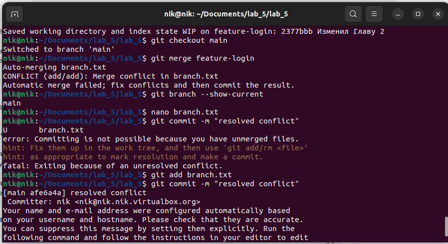

# Отчет 

#### Введение 

 1. Создал репозиторий lab_5

 2. C помощью команды _git clone_ и _cd_ я скопировал репозиторий и перешел в папку с ним 

 3. Создал файл example.txt добавил в него текст и запушил на гитхаб с помощью  _git add_, _git commit -m_ и _git push_

 4. Создал новую ветку feature-branch и перешел в нее c помощью _git checkout_

 5. Отредактировал файл example.txt переключился в ветку main и слил изменения в основную ветку с помощью _git merge_, _git push_

#### Работа с ветками 

 1. Создал новый текстовый файл branch.txt 

 2. Cоздал новую ветку feature-login 2 с
 
  помощью _git checkout_ 

 3. Внес изменения в файл и комитнул их с помощью _git add_, _git commit -m_, _git push origin_.

#### Работа с удаленным репозиторием

1. Переключился на основную ветку main, внес изменения, закомитил и отправил их с помощью _git add branch.txt _git commit -m ""_ и _git push origin main_

#### Моделирование конфликта

1. Перешел на ветку feature-login, внес изменения в файл branch.txt, комитнул изменения и отправил на github 

#### Разрешение конфликта

1. Возвращаюсь в основную ветку и пытаюсь слить изменения с помощью _git checkout main_  _git pull origin main_

2. Получаю конфликт. Редактирую файл, оставляя нужные изменения. 

3. Комичу разрешение конфликта и отправляю на github. 

#### Автоматизация проверки формата файлов при коммите

1. Создал bash скрипт для проверки example.txt 

2. Добавил скрипта в репозиторий, поместил в папку .git/hooks и убедился, что у него есть права с помощью _cp_ и _chmod +x_.

3. Внес изменения и закоммитил. Теперь, при каждой попытке закоммитить изменения, Git будет автоматически выполнять проверку формата файлов.

#### Использование Git Flow в проекте

1. Установка Git Flow и проверка _sudo apt-get install git-flow_.

2. Инициализировал Git Flow  с помощью _git flow init_.

3. Создал ветки для новой функциональности "task-management" с помощью _git flow feature start task-management_.

4. Внесизменения в код для добавления функционала управления задачами _task_manager.py_ и закоммитил.

    

5. Завершил фичу и объединил его с основной веткой с помощью _git flow feature finish task-management_.

6. Переключился на ветку _develop_ и начал создание релиза:
_git checkout develop_
_git flow release start v1.0.0_

7. Внес изменения:
_echo "v1.0.0" > version.txt_
_git add version.txt_
_git commit -m "Обновлена версия для релиза v1.0.0"_

8. Завершил релиз и объединенил его с ветками _develop_ и _main_:
_git flow release finish v1.0.0_

9. Создал _hotfix_ с помощью:
_git flow hotfix start hotfix-1.0.1_

10. Внесение изменения для исправления ошибки и коммит:
_git add file_with_error.py_
_git commit -m "Исправлена критическая ошибка"_
    
    

11. Завершил _hotfix_ и объединение его с ветками _develop_ и _main_:
_git flow hotfix finish hotfix-1.0.1_

12. Отправил изменения на удаленный репозиторий:
_git push origin develop_
_git push origin main_
